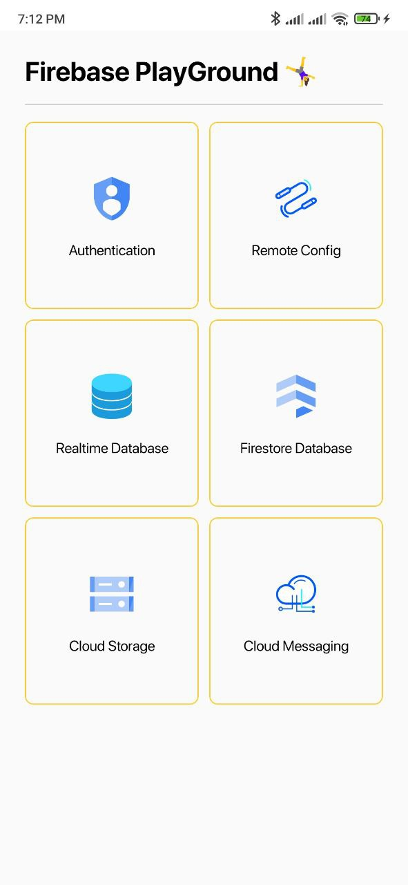

# Firebase Playground

Firebase Playground is an app for demo purposes, I collect on it most of the Firebase services that could be applied for Android.

You can download the app from MediaFire and try it.

## Screenshots

   
   
   
   
  

## 📚 Android tech stack

One of the main goals of Firebase Playground is to try most of the Firebase services that are available for Android.

### 🧑🏻‍💻 Android development

- Application is entirely written in [Kotlin](https://kotlinlang.org)
- Complete migrated to [Jetpack Compose](https://developer.android.com/jetpack/compose)
- Asynchronous processing using [Coroutines](https://kotlin.github.io/kotlinx.coroutines/)
- Dependency injection with [Hilt](https://dagger.dev/hilt/)
- Architectural pattern using [MVVM](https://en.wikipedia.org/wiki/Model%E2%80%93view%E2%80%93viewmodel)
- Firebase Authentication [Authentication with Firebase](https://firebase.google.com/docs/auth/android/start)
- Firebase RemoteConfig [Remote config with Firebase](https://firebase.google.com/docs/remote-config/get-started?platform=android)
- Firebase Realtime Database [Firebase Database](https://firebase.google.com/docs/database/android/start)
- Firebase Firestore [Cloud Firestore in Android](https://firebase.google.com/docs/firestore/quickstart)
- Firebase Cloud Storage [Cloud Storage in Android](https://firebase.google.com/docs/storage/android/start)
- Firebase Cloud Messaging [FCM](https://firebase.google.com/docs/cloud-messaging)

### Features ✨

- Firebase Authentication
    - Email Password Authentication
        - With the Firebase Playground app, you can login and Register for the app using your email and password with error handling the app will print a toast with the error if exists or print a toast with UID when Success

- Firebase Remote Config
    - There is a parameter on the Firebase remote config called "app_version" You can fetch it when clicking the fetch button or you can listen for this parameter updates and the parameter will be fetched automatically when it's updated on Firebase console

- Firebase Realtime Database
    - Fetch a list of schools that exist in a database built using Firebase.
    - Listen to updates in real-time, any update will be reflected automatically in the list.
    - Add School with School name and school description.
    - Edit school name or description that already exists
    - Delete school from the database
    - Order the school list ASC or DES based on the school name.
    - Search for a school in the database by school name.

- Firebase Firestore
    - Fetch a list of schools that exist in a database built using Firebase.
    - Listen to updates in real-time, any update will be reflected automatically in the list.
    - Add School with School name and school description.
    - Edit school name or description that already exists
    - Delete school from the database
    - Order the school list ASC or DES based on the school name.
    - Search for a school in the database by school name

- Firebase Cloud Storage
    - Select a photo from the device
    - You can add a caption for the photo (optional)
    - Upload the photo to the Cloud Storage and observe the progress state by linear progress indicator.
    - Get all photos from the Storage and display them on a bottom sheet.

- Firebase Cloud Messaging
    - If the app is installed on your device you will receive a notification from the app every day at 12:00 pm based on time zone in Cairo (GMT+3).

- Other Firebase services like Crashlytics and Performance.

### Upcoming features 🕓

- Other Authentication methods like phone and Google etc...

## Find this repository useful? :heart:
Support it by putting a star for this repository. :star:  
Also, __[follow me](https://github.com/3wiida)__ on GitHub for my next creations! 🤩
